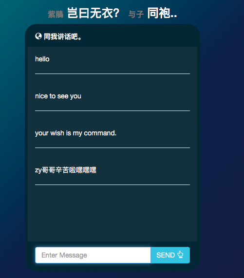

# Zijuan

An multi-modal Chatbot for online shopping assistent.

## Deliverables

1. Parse the text, and /or image query by users to ensure that the query is consistency and logical, and possibly infering the intent of users 
2. Overall design and scalability of app to handle multiple concurrent users.

## TODO LIST

1. Simple UI & chatbot ☑️

2. Integration with Lizi & Yunshan 's chatbot

    * handle image query
    * save conversation history

3. Topic and sentiment inferring  [Siru]

   Given the conversation history:

   * Identify topic
   * Sentiment Score {Positive, Negative, Neutral}
   * In `get_sentiment_score.py` and `get_topic.py`

   Training corpus can be found [here](https://amritasaha1812.github.io/MMD/download/)

4. Handle multiple concurrent users

## Report and Presentation

1. Presentation slides can be found [here](https://docs.google.com/presentation/d/12VCPJPrAIg1I2sHDaZWW552Rx9hBkgw-QzwJQ1llKhc/edit?usp=sharing)
2. Report can be found [here](https://www.overleaf.com/15066791jkfhnjntgtkc)

## Schedule

**Week 11**: 

* **Monday**: update 2. Meeting with Lizi. Integration should be done by then.

**Week 13**:

* **Monday**: Submission of report, ppt, code.
* **Monday**: Class presentation. (10 mins)
* **Thursday**: Detailed presentation. (18 mins)

## License
This source is free to use, but ChatterBot does have a license which still applies and can be found on the [LICENSE](https://github.com/gunthercox/ChatterBot/blob/master/LICENSE) page.
